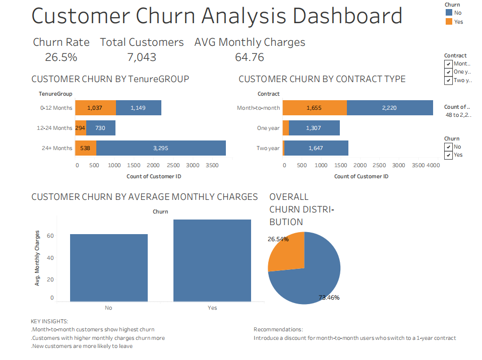

# telco-customer-churn-analysis
## Project Objective
This project analyzes telecom customer churn behavior to identify factors contributing to customer attrition and recommend data-driven business solutions.

---

## Tools Used
- Excel
- SQL (Google BigQuery)
- Tableau

---

## Analysis Performed
- Overall churn analysis
- Contract type vs churn analysis
- Tenure group analysis
- Monthly charges analysis
- High-risk customer identification

---

## Key Insights
- Customers with month-to-month contracts had the highest churn.
- Customers with shorter tenure were more likely to leave.
- Higher monthly charges correlated with increased churn probability.
- Long-term contract customers showed better retention.

---

## Business Recommendations
- Encourage long-term contracts using loyalty offers.
- Improve onboarding for new customers.
- Create retention campaigns for high-risk customers.

---

## Dashboard Preview

---

## Project Structure:

customer-churn-analysis:
│
├── Excel_Dashboard
├── SQL_Analysis
├── Tableau_Dashboard
├── Screenshots
└── README.md
